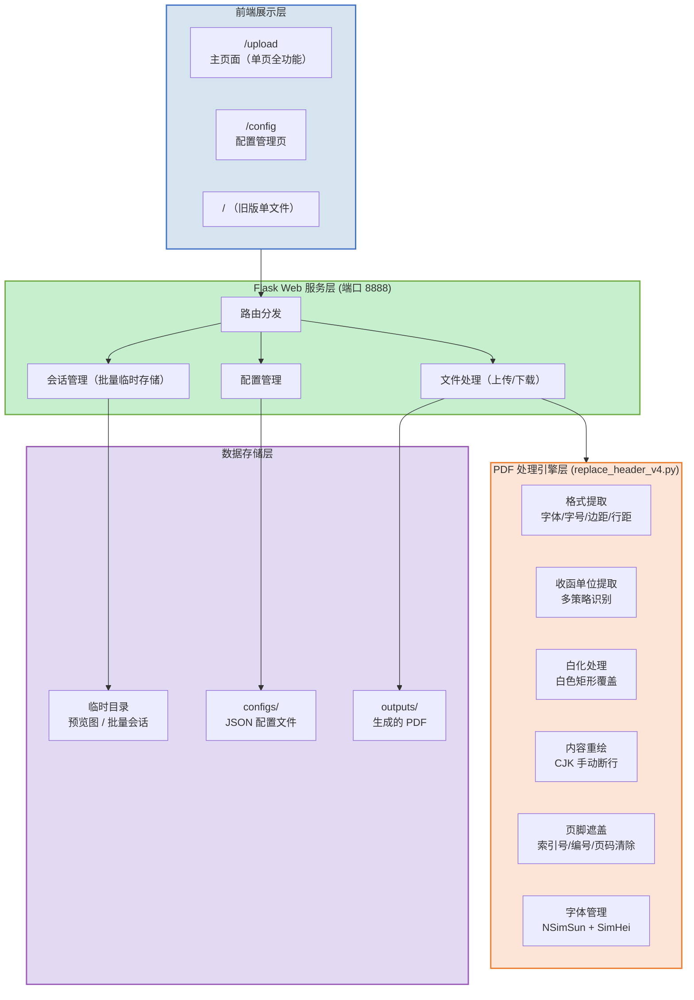
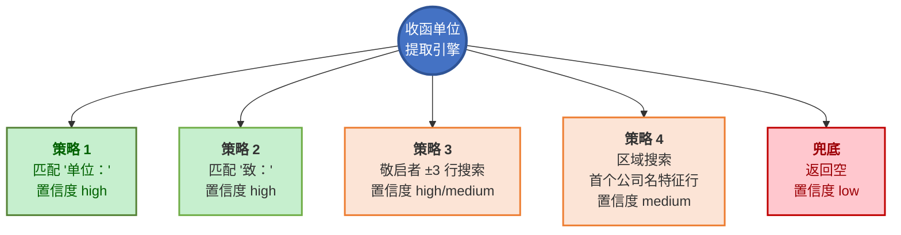
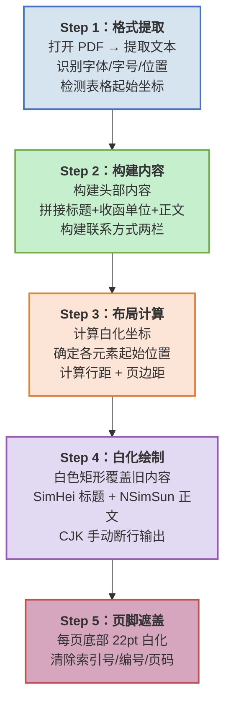
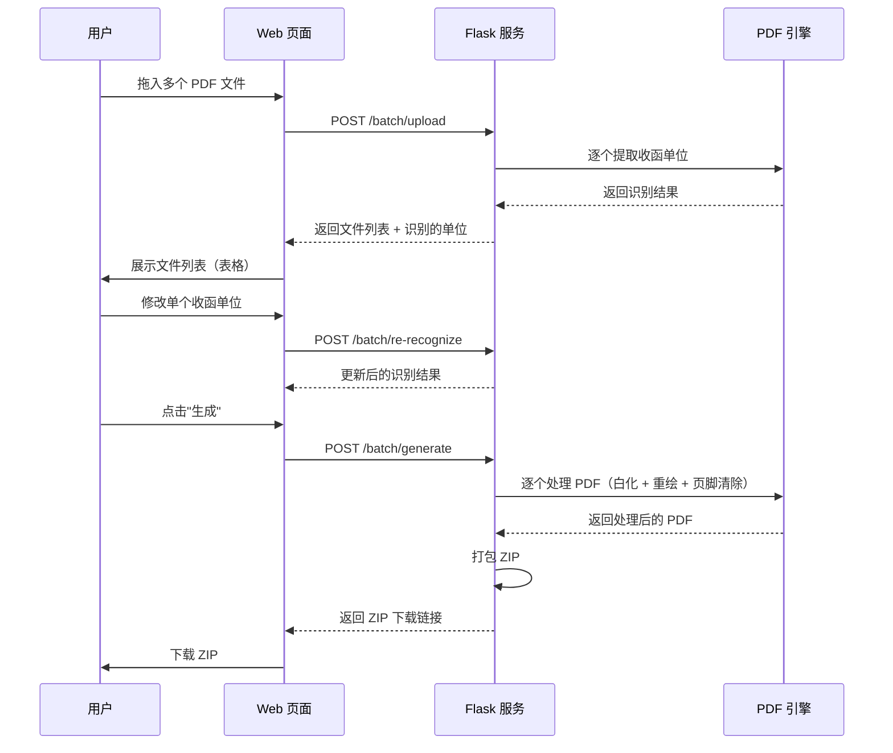
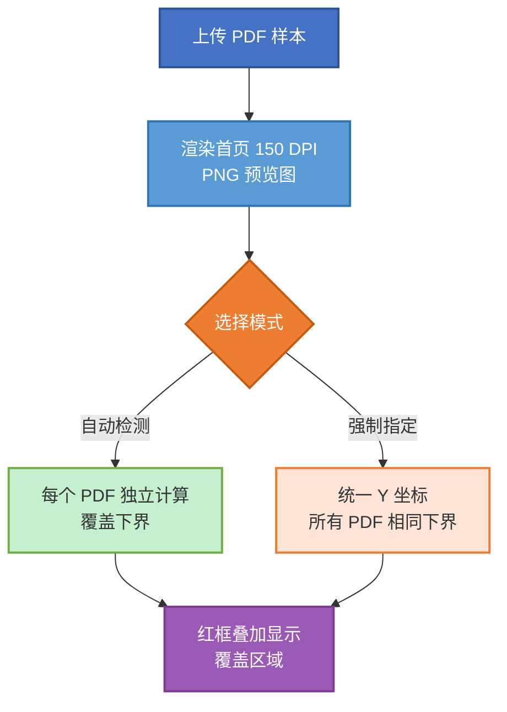
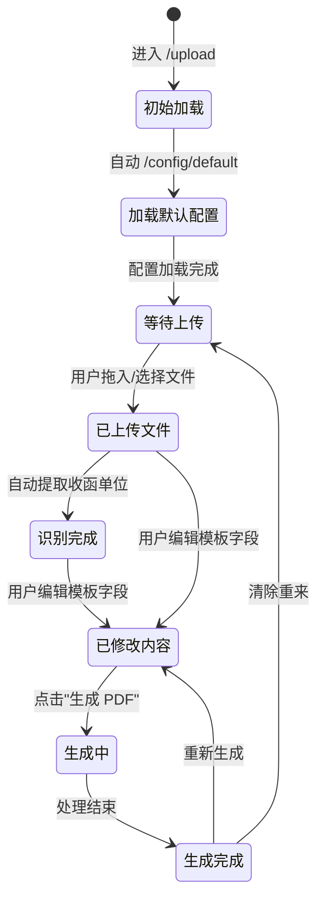

# 函证 PDF 头部内容替换工具 — 需求规格说明书

> **版本**：v5.0  
> **日期**：2026-08-20  
> **状态**：终稿  
> **主要变更**：Python 版功能已全部实现并验证，新增「每页页脚遮盖」能力（清除会所索引号/编号/页码），补齐批量处理、覆盖校准、收函单位提取的完整说明。

---

## 目录

- [1. 项目背景与目标](#1-项目背景与目标)
- [2. 业务流程图](#2-业务流程图)
- [3. 系统架构](#3-系统架构)
- [4. 页面布局设计](#4-页面布局设计)
- [5. 配置管理体系](#5-配置管理体系)
- [6. 收函单位提取策略](#6-收函单位提取策略)
- [7. PDF 处理引擎](#7-pdf-处理引擎)
- [8. 批量处理 API](#8-批量处理-api)
- [9. 覆盖区域校准](#9-覆盖区域校准)
- [10. 每页页脚遮盖（v5 新增）](#10-每页页脚遮盖v5-新增)
- [11. 前端状态管理](#11-前端状态管理)
- [12. 启动与部署](#12-启动与部署)
- [13. 已知问题与经验教训](#13-已知问题与经验教训)
- [附录 A：Java 原版说明](#附录-ajava-原版说明)
- [附录 B：Python 版文件清单](#附录-bpython-版文件清单)

---

## 1. 项目背景与目标

### 1.1 业务场景

券商（投行）项目组在 IPO、再融资等业务中需要向银行、客户发送大量询证函。实际操作中，项目组通常直接修改会计师事务所已完成的函证 PDF，**替换头部信息（函证说明、地址、联系人等）为券商项目组自身信息**，快速完成发函。

这是效率最高、错误最少的操作方式。同时，会所原函证 PDF 的**每页底部**通常带有会所内部业务流水号（索引号）、档案编号、页码（如 `索引号:CG-X1  编号:202657336-4178286  第1页/共2页`），这些内容不属于券商发函应携带的信息，也需要一并清除。

### 1.2 核心价值

| 维度 | 说明 |
|------|------|
| **提效** | 自动识别原 PDF 格式 → 白化 → 重写，1 分钟内完成手工需 10+ 分钟的操作 |
| **防错** | 智能提取收函单位、自动计算布局，避免手动输入错漏 |
| **批量** | 一次上传最多 20 份 PDF，自动批量识别 + 批量替换 + 打包下载 |
| **复用** | 配置模板持久化，一键加载券商默认信息 |
| **合规** | 自动清除每页底部的会所索引号/编号/页码，券商发函版本不含会所内部档案信息 |

### 1.3 技术选型（Python 版）

| 层 | 技术 |
|----|------|
| **Web 框架** | Flask（单线程 + threaded=True） |
| **PDF 处理** | PyMuPDF (fitz) + pdfplumber |
| **前端** | HTML5 + CSS3 + Vanilla JS（无框架） |
| **字体** | NSimSun.ttf（正文）+ SimHei.ttf（黑体加粗标题/提示行） |
| **端口** | 8888 |
| **上传上限** | 32 MB（`MAX_CONTENT_LENGTH`） |
| **运行环境** | conda `pytorch` 环境的 Python（`E:\08_Anaconda3\Anaconda3\envs\pytorch\python.exe`） |

> 双版本架构：Java（PDFBox，端口 8889）为主力，Python（PyMuPDF）用于功能验证与日常使用。两版核心逻辑保持一致，本文档以 **Python 版已实现功能**为准。

---

## 2. 业务流程图


**流程说明**：

1. **上传 PDF** — 用户上传会计师事务所出具的函证 PDF 文件（支持拖拽/选择，单次最多 20 份）
2. **智能识别** — 系统自动提取原 PDF 格式参数（字体、字号、边距、行距），并识别收函单位
3. **核对编辑** — 用户在 Web 界面确认/修改识别结果，填入券商联系方式
4. **覆盖校准** — 通过红色遮罩拖拽调整头部覆盖区域的下界，避免误伤表格
5. **生成替换** — 白化原头部区域，按原格式重新绘制券商信息，并清除每页底部页脚
6. **下载预览** — 下载最终 PDF（单文件）或 ZIP 压缩包（批量）

---

## 3. 系统架构

### 3.1 架构总览



### 3.2 分层说明

| 层 | 说明 | 关键技术 |
|----|------|----------|
| 前端展示层 | 单页面应用，三大功能入口 | HTML5 + CSS3 + Vanilla JS |
| Web 服务层 | 路由分发、会话管理、配置管理、文件处理 | Flask |
| PDF 处理引擎 | 格式提取 → 收函单位提取 → 白化 → 重绘 → 页脚清除 | PyMuPDF + pdfplumber |
| 数据存储层 | JSON 配置 + 生成 PDF 持久化 + 临时文件 | 本地文件系统 |

### 3.3 API 路由表

#### 单文件处理（旧版）

| 路由 | 方法 | 功能 |
|------|------|------|
| `/` | GET | 单文件处理页面（旧版） |
| `/preview` | POST | 上传 PDF，渲染首页 PNG 预览 |
| `/preview-img/<filename>` | GET | 预览图片静态服务 |
| `/generate` | POST | 接收表单数据，生成替换后 PDF |
| `/download/<filename>` | GET | 下载生成的 PDF |

#### 批量处理（`/upload` 主入口）

| 路由 | 方法 | 功能 |
|------|------|------|
| `/upload` | GET | **主页面**（单页全功能） |
| `/batch` | GET | 301 重定向到 `/upload`（向后兼容） |
| `/batch/upload` | POST | 批量上传（最多 20 份），自动提取收函单位 |
| `/batch/preview/<token>/<filename>` | GET | 单个 PDF 的首页缩略图 |
| `/batch/re-recognize` | POST | 重新识别单个文件的收函单位 |
| `/batch/generate` | POST | 批量生成 PDF → 打包 ZIP 下载 |
| `/batch/download/<token>` | GET | 下载 ZIP 包 |

#### 配置管理

| 路由 | 方法 | 功能 |
|------|------|------|
| `/config` | GET | 配置管理页面 |
| `/config/default` | GET | 获取默认配置 |
| `/config/list` | GET | 列出所有可用配置 |
| `/config/load/<name>` | GET | 加载指定配置 |
| `/config/save` | POST | 保存新配置 |
| `/config/delete/<name>` | DELETE | 删除配置 |
| `/config/preview` | POST | 上传样本 PDF 预览 + 表格检测 |

---

## 4. 页面布局设计

### 4.1 主页面（`/upload`）— 单页全功能

以折叠面板（Accordion）组织三大功能模块，实现"上传→预览→填写→生成"一站式操作。

```
┌──────────────────────────────────────────────────────┐
│  函证 PDF 头部内容替换工具                            │
├──────────────────────────────────────────────────────┤
│  ┌─ 步骤 1：上传 PDF ──────────────────────────────┐  │
│  │  拖拽区 / 文件选择按钮 / 已上传列表               │  │
│  │  每份 PDF 自动提取收函单位并显示（含置信度）      │  │
│  └────────────────────────────────────────────────┘  │
│                                                      │
│  ┌─ 步骤 2：填写内容 ──────────────────────────────┐  │
│  │  模板名称下拉框（含默认）                          │  │
│  │  函证正文 textarea（最长 250/300 字符，字数统计）  │  │
│  │  联系方式表格（5 字段）                            │  │
│  └────────────────────────────────────────────────┘  │
│                                                      │
│  ┌─ 步骤 3：覆盖区域校准 ──────────────────────────┐  │
│  │  PDF 首页预览图 + 红色遮罩 + 拖拽调整下界          │  │
│  │  自动检测 / 强制指定 切换开关                      │  │
│  └────────────────────────────────────────────────┘  │
│                                                      │
│  [ 生成 PDF ]  [ 下载 ZIP ]                          │
│                                                      │
└──────────────────────────────────────────────────────┘
```

**页面标题**：PDF 格式转函

**核心交互元素**：

| 元素 | 说明 |
|------|------|
| 拖拽/选择区 | 支持拖入多个 PDF，自动开始批量识别 |
| 文件列表 | 每行显示文件名、识别出的收函单位、置信度标签、缩略图、重新识别按钮 |
| 模板下拉框 | 列出所有配置模板，含当前默认配置 |
| 函证正文 | textarea，实时字数统计，超限警告 |
| 联系方式 | 5 个字段：项目联系人、项目联系人电话、收件人、收件人电话、邮箱 |
| 覆盖校准 | 预览图 + 红色遮罩 + 拖拽手柄（`≡`），实时显示 Y 坐标 |
| 操作按钮 | 生成 PDF（单文件/批量）、下载 ZIP |

### 4.2 配置管理页面（`/config`）

两部分设计：

- **步骤 1：覆盖区域校准** — 上传一份样本 PDF，拖拽调整覆盖下界，预览白化效果
- **步骤 2：模板内容编辑** — 填写函证正文 + 联系方式，保存/更新/删除模板，设置默认

**页面标题**：模板配置 - 函证头部替换工具

### 4.3 旧版单文件页面（`/`）

旧版兼容入口，提供单文件处理的基础功能（包含 PDF 预览拖拽交互）。路由仍保留，供老用户使用。

---

## 5. 配置管理体系

### 5.1 配置流程


### 5.2 配置存储结构

```
python/configs/
├── _default.txt          ← 仅存一行：默认配置名
├── <配置名>.json          ← 每个配置一个 JSON 文件
└── ...
```

**配置 JSON 结构**：

```json
{
  "name": "中德配置",
  "body_text": "本公司聘请的中德证券股份有限公司...",
  "contacts": {
    "项目联系人": "张三",
    "项目联系人电话": "13800010002",
    "收件人": "中德证券投行部",
    "收件人电话": "13800010002",
    "邮箱": "ceshi@qq.com"
  },
  "whiteout_bottom": 253
}
```

| 字段 | 类型 | 说明 |
|------|------|------|
| `name` | String | 配置展示名称 |
| `body_text` | String | 函证正文，最长 300 字符 |
| `contacts` | Object | 联系方式（5 个固定字段） |
| `whiteout_bottom` | Number/null | 覆盖下界 Y 坐标，`null` = 自动检测 |

### 5.3 默认配置机制

- `_default.txt` 只存一行默认配置名
- 每次进入 `/upload`，前端自动调用 `/config/default` 填入模板字段
- 用户可临时修改（不持久化）；需保存才写入配置
- `/config/default` 返回逻辑：默认配置 → 无默认时返回第一个配置 → 都无则报错

### 5.4 设计原则

- **配置和上传分离**：高频操作（上传+生成）在 `/upload`；低频操作（保存/调整模板）在 `/config`
- **覆盖下界**：默认用配置值；仅当用户拖拽 + 强制时才覆盖

---

## 6. 收函单位提取策略

### 6.1 策略总览



**提取区域**：PDF 首页 y ∈ [50, 300] 像素范围，逐行扫描。

### 6.2 优先级与置信度

| 优先级 | 策略 | 触发条件 | 置信度 |
|--------|------|----------|--------|
| **P1** | 匹配"单位：" | 行内包含"单位：" | high |
| **P2** | 匹配"致：" | 行内包含"致：" | high |
| **P3a** | 敬启者同行前文 | 行内"敬启者"前符合公司名特征 | high |
| **P3b** | 敬启者同行后文 | 行内"敬启者"后符合公司名特征 | high |
| **P3c** | 敬启者邻行 | 向前后 ±3 行搜索公司名特征 | medium |
| **P4** | 区域搜索 | 首个符合公司名特征的行 | medium |
| **兜底** | 返回空 | 全部失败 | low |

### 6.3 公司名特征判断 `_is_likely_company_name`

- 长度 4~30 个字符
- 至少 4 个中文字符，且中文占比 ≥ 50%
- 排除关键词：单位：、致：、敬启者、编号、索引、询证函、会计师、审计、列示、余额、项目联系人、回函地址、收件人、邮编、邮箱、电话、传真等

---

## 7. PDF 处理引擎

### 7.1 处理流程



### 7.2 Step 1：格式提取 `extract_format`

从原 PDF 首页自动提取：

| 参数 | 提取逻辑 |
|------|----------|
| **正文字号** | y ∈ [50, 270] 区域，字号落在 [8, 14] 范围内的最常见字号（默认 10.5） |
| **标题字号** | 全页最大字号（默认 18.0） |
| **左边距** | y ∈ [50, 260] 区域内字符的最小 x0 |
| **段落宽度** | 最大 x1 - 最小 x0 - 8 |
| **行间距** | 相邻行 y 差值（10~40pt 范围内）的均值（默认 15.7） |
| **表格起始 Y** | 通过关键词定位（见下） |

**表格起始检测 `_find_table_start`**：
- 主匹配：关键词 `往来余额`、`往来款项`、`列示如下`、`余额列示`、`往来账项`，命中后返回该行 y - 3
- 兜底：首个以 `数字 + 序号符号` 开头的行
- 最终兜底：返回 267

### 7.3 Step 2：构建内容

```python
header_lines = [
    ('title', '企业询证函'),                    # 居中大标题
    ('body', f'致：{company_name}'),            # 收函单位
    ('body', '　　' + body_text),               # 正文（首行缩进两全角空格）
]

contact_lines = [
    ('pair', '项目联系人：张三', '项目联系人电话：13800010002'),
    ('pair', '收件人：李四', '收件人电话：13900020003'),
    ('single', '邮箱：test@example.com'),
]
```

**提示行（固定文案）**：
```
若您方有相关本询证函函证事项问题，请直接联系下方项目联系人电话：
```

### 7.4 Step 3：布局计算

```
页面顶部 (y=48)
  ├── 标题行（居中，SimHei 加粗）
  ├── 收函单位行（左对齐，按原格式）
  ├── 函证正文（CJK 手动断行，左对齐）
  ├── 加粗提示行（SimHei，固定文字）
  ├── 联系方式（两栏自适应布局）
  │   ├── 项目联系人（左）| 项目联系人电话（右）
  │   ├── 收件人（左）| 收件人电话（右）
  │   └── 邮箱（全宽单行）
  └──→ 白色覆盖下界 whiteout_bottom
页面底部
  └── 原 PDF 表格区域（完全保护，不修改）
```

**关键计算**：
- 头部起始 y=48，每个子行占 `字号 + 5`，行距 = 正文行距
- 联系方式起始 y = max(头部结束 + 4, 188)
- 联系方式不可超过 `table_y - 5`，放不下则压缩行距（下限 12pt）
- **白化下界**：
  - 用户指定：`min(用户值, table_y - 3)`
  - 自动：`min(max(头部结束, 提示结束, 联系方式+30), table_y - 3)`

### 7.5 Step 4：白化绘制

- 用 `add_redact_annot` + `apply_redactions` 一次性白化头部区域（y=0 → whiteout_bottom）
- 重新嵌入字体：`NSimSun`（正文）、`SimHei`（黑体加粗）
- 逐块写入文字：
  - 标题/正文/联系方式：NSimSun
  - 提示行：优先 SimHei 真加粗；无黑体时用 NSimSun 偏移 0.5pt 伪加粗

### 7.6 CJK 手动断行算法 `wrap_cjk_text`

逐字符累加宽度预估，避免自动换行导致的标点错位：

```
全角字符宽度 = fontsize × 1     // 中文、中文标点
半角字符宽度 = fontsize × 0.55  // 英文、数字、英文标点
```

### 7.7 字体管理

| 用途 | 字体 | 查找路径（优先级） |
|------|------|-------------------|
| 正文 | NSimSun（新宋体） | `fonts/NSimSun.ttf` → `C:\Windows\Fonts\simsun.ttc` |
| 黑体加粗 | SimHei（黑体） | `fonts/simhei.ttf` → `C:\Windows\Fonts\simhei.ttf` → simfang → simsunb（最后回退） |

> 注意：`simsunb.ttf` 实为 SimSun-ExtB，缺少常用汉字，仅作为最后回退。

---

## 8. 批量处理 API

### 8.1 批量处理流程



### 8.2 批量处理能力

| 项目 | 限制 |
|------|------|
| 单次上传文件数 | 最多 20 个 |
| 支持格式 | PDF（.pdf） |
| 单文件大小 | 受服务全局 32 MB 限制 |
| 输出格式 | ZIP 压缩包 |
| 会话存储 | 内存临时存储（服务重启后丢失） |
| 收函单位覆盖 | 支持前端手动修改单个/全部，优先于自动识别 |

### 8.3 批量收函单位处理优先级

1. 前端手动输入的收函单位（`recipients[fileId]`）
2. 自动识别结果（`file.recipient`）
3. 为空则报错跳过，不中断其他文件

---

## 9. 覆盖区域校准

### 9.1 两种模式



### 9.2 可视化交互元素

| 元素 | 说明 |
|------|------|
| 红色遮罩 | 半透明红色，覆盖将被白化的区域 |
| 绿色横线 | 标注表格保护起始位置（`legend-bar`） |
| 拖拽手柄 | 红色 `≡` 条，鼠标/触摸拖拽调整下界 |
| Y 坐标标签 | 实时显示当前下界值（pt） |

### 9.3 前端逻辑

- `autoWhiteoutBottom`：后端 `/config/preview` 返回的自动检测值（`table_y - 3`）
- `userWhiteoutBottom`：当前生效值，初始 = 自动值
- 拖拽范围：`48 ≤ y ≤ tableY - 5`
- 状态显示：
  - `forceWhiteout=false` → "自动检测 (N pt)"
  - `forceWhiteout=true` → "手动 N pt（自动: M pt）"
- 按钮：
  - **重置为自动** → 回到 `autoWhiteoutBottom`
  - **使用自动值 / 强制此值** → 切换强制模式

### 9.4 表格起始坐标检测（`/config/preview`）

后端用 pdfplumber 提取首页字符，按 y 分组（`round(top/3)*3`），调用 `_find_table_start` 得到 `table_y`，推荐自动覆盖下界：

```python
auto_whiteout = max(48, min(table_y - 3, page_h * 0.55))
```

---

## 10. 每页页脚遮盖（v5 新增）

### 10.1 需求背景

会所原函证 PDF 的**每一页底部**都带有会所内部信息：

```
索引号:CG-X1    编号：202657336-4178286    第1页/共2页
```

这些内容包括：
- **索引号**：会所内部业务流水号
- **编号**：会所档案/函证编号
- **页码**：第 N 页/共 M 页

券商发函版本**不应携带**会所内部档案信息，需要全部清除。

### 10.2 实现函数

```python
def redact_footer_per_page(doc, footer_height=22.0, verbose=False):
    """对 PDF 每一页底部一块区域做白化（移除会所档案号/页码等页脚信息）。"""
    for idx, page in enumerate(doc):
        page_h = page.rect.height
        page_w = page.rect.width
        y_top = page_h - footer_height        # 底部 22pt 起点
        rect = fitz.Rect(0, y_top, page_w, page_h)
        page.add_redact_annot(rect, fill=(1, 1, 1))
        page.apply_redactions()               # 逐页立即 apply
```

### 10.3 设计决策

| 决策项 | 选择 | 理由 |
|--------|------|------|
| 高度策略 | 固定 22pt | 简单、对页脚格式变化鲁棒，函证页脚字号通常 8~9pt |
| 宽度 | 整页全宽 | 索引号/编号/页码横跨整页，必须全宽遮盖 |
| 触发机制 | 固定带（非关键字识别） | 避免依赖特定文本格式 |
| 白化时序 | 逐页立即 apply | 避免跨页字体/图片引用时出错 |
| 安全性 | 22pt < 页边距 | PDF 页边距通常 ≥ 50pt，不会误伤表格末行 |

### 10.4 调用位置

在 `process_from_data` 中，头部处理完成后、保存 PDF 前调用：

```python
ok = process_page(doc, header_lines, contact_lines, fmt, ...)
n_footer = redact_footer_per_page(doc, footer_height=22.0, verbose=verbose)
doc.save(output_path, garbage=4, deflate=True)
```

### 10.5 覆盖范围

- **全部入口生效**：单文件 `/generate`、批量 `/batch/generate` 都走统一入口 `process_from_data`，页脚遮盖自动生效
- **所有页面**：遍历 `doc` 全部页面，不仅第 1 页

### 10.6 验证结果

用 `data/会所pdf4.pdf`（2 页）离线验证：

| 页 | 原始底部内容 | 处理后底部内容 |
|----|--------------|----------------|
| 第1页 | `索引号:CG-X1  编号：202657336-4178286  第1页/共2页` | `<空>` ✓ |
| 第2页 | `索引号:CG-X1  编号：202657336-4178286  第2页/共2页` | `<空>` ✓ |

头部功能仍正常（9/9 块写入成功）。

---

## 11. 前端状态管理

### 11.1 页面状态机



### 11.2 关键状态变量

| 变量 | 类型 | 说明 |
|------|------|------|
| `fileList` | Array | 已上传文件列表（含 id、路径、收函单位、置信度） |
| `configWhiteoutBottom` | Number/null | 配置中的覆盖下界值 |
| `previewData` | Object | 覆盖预览数据：imageUrl、pageHeight、tableY、autoWhiteoutBottom、userWhiteoutBottom |
| `forceWhiteout` | Boolean | true=强制使用手动拖拽值 |
| `defaultConfigName` | String | 当前默认配置名 |
| `sessionToken` | String | 批量会话 token |

### 11.3 前端交互细节

- 拖拽上传支持鼠标 + 触摸
- 覆盖遮罩拖拽实时更新，支持 `mouseup` 释放
- 生成时优先取 `userWhiteoutBottom`（若 force），否则取 `configWhiteoutBottom`

---

## 12. 启动与部署

### 12.1 一键启动脚本

项目根目录已提供两个启动脚本：

| 脚本 | 启动服务 | 端口 | 访问地址 |
|------|----------|------|----------|
| `启动Python版服务.bat` | Python Web（`web_form_server.py`） | 8888 | http://localhost:8888 |
| `启动Java版服务.bat` | Java Web（`com.hanzheng.WebServer`） | 8889 | http://localhost:8889 |

### 12.2 Python 版启动脚本逻辑

```batch
@echo off
chcp 65001 >nul
set "ROOT=%~dp0"
cd /d "%ROOT%python"
set "PY_EXE=E:\08_Anaconda3\Anaconda3\envs\pytorch\python.exe"
if not exist "%PY_EXE%" (
    where python >nul 2>nul
    if errorlevel 1 ( echo [错误] 未找到 python && pause && exit /b 1 )
    set "PY_EXE=python"
)
"%PY_EXE%" web_form_server.py
pause
```

### 12.3 手动启动

```bash
cd python
E:\08_Anaconda3\Anaconda3\envs\pytorch\python.exe web_form_server.py
# 浏览器访问 http://localhost:8888
```

### 12.4 环境依赖

- conda `pytorch` 环境（Python 3.x）
- 依赖包：`flask`、`pymupdf (fitz)`、`pdfplumber`
- 字体：NSimSun.ttf（正文）、SimHei.ttf（黑体）

---

## 13. 已知问题与经验教训

### 13.1 已知问题

| 问题 | 原因 | 解决方案 |
|------|------|----------|
| **坐标系混用** | PDFBox 左下角原点 vs 前端左上角原点 | 统一坐标系后再做 min/max 计算 |
| **simsunb.ttf 陷阱** | 该文件实为 SimSun-ExtB，缺少常用汉字 | 改用 SimHei.ttf 真黑体 |
| **伪加粗重影** | 中文宋体任何偏移都产生重影 | 使用真粗体字体（SimHei） |
| **Windows 中文乱码** | 命令行编码 + JVM 编码不一致 | chcp 65001 + `-Dfile.encoding` + 重包装 System.out |
| **批量下载后缀丢失** | 文件名清洗时 .pdf 的点号被转成 _ | 先分离扩展名再清洗文件名 |
| **白化参数失效** | `whiteout_bottom` 写在 catch 块中 | 移到正常流程中传递 |
| **源 PDF xref 错误** | 部分会所 PDF 自身 xref 损坏 | MuPDF 会打印 `cannot find object in xref`，但不影响处理结果 |

### 13.2 设计约束

| 项目 | 约束 |
|------|------|
| 函证正文最大长度 | 单文件 250 / 批量 300 字符 |
| 联系方式固定字段 | 5 个（项目联系人、电话、收件人、电话、邮箱） |
| 提示行文字 | 固定模板，不可修改 |
| 表格区域 | 原封不动保留，不做任何改动 |
| 正文字体 | NSimSun（新宋体） |
| 标题字体 | SimHei（黑体加粗） |
| 覆盖下界最小值 | 48 pt |
| 页脚遮盖高度 | 22 pt（固定） |
| 单次批量上传 | 最多 20 份 |

### 13.3 合规性说明

- 工具的核心价值在于**格式转换**：把会所制作的函证内容，重排为券商发函格式
- 合规关键不在"替换头部"本身，而在券商是否**真实独立执行函证程序**（独立发函、回函控制、风险判断），以及**底稿能否完整还原**（建议保留会所原版 + 券商版双版本归档）
- 工具在技术上**生成全新 PDF** 而非在原文件上打补丁，减少篡改痕迹
- 页脚遮盖用于移除会所内部档案号，符合"券商发函版本不含会所内部信息"的要求

---

## 附录 A：Java 原版说明

Java 版为主力运行方案之一，核心类：

| 类名 | 功能 |
|------|------|
| `WebServer.java` | HTTP 服务主程序，端口 8889 |
| `HanzhengPdfTool.java` | CLI 命令行入口 |
| `PdfProcessor.java` | PDF 处理核心（格式提取 + 白化 + 重绘） |
| `FormatExtractor.java` | 格式自动提取 |
| `CjkWrapper.java` | CJK 手动断行 |

> 注意：Java 版当前 `PdfProcessor.processPage` 仅处理 `doc.getPage(0)`，**尚未实现页脚遮盖**。如需同步，需在 `PdfProcessor.java` 增加逐页页脚白化逻辑。

### Java 启动

```batch
cd java
run.bat          # 启动 Web 服务（端口 8889）
start_server.bat # 后台启动
```

### Java 依赖

```xml
<dependency>
    <groupId>org.apache.pdfbox</groupId>
    <artifactId>pdfbox</artifactId>
    <version>2.0.27</version>
</dependency>
```

---

## 附录 B：Python 版文件清单

```
python/
├── web_form_server.py      # Flask Web 服务（路由/会话/配置管理/文件处理）
├── replace_header_v4.py    # PDF 处理引擎（格式提取/收函提取/白化/重绘/页脚遮盖）
├── templates/              # Web 前端模板
│   ├── upload.html         # 主页面（单页全功能）
│   ├── config.html         # 配置管理页面
│   ├── index.html          # 旧版单文件页面
│   └── batch.html          # 批量处理页面（备用）
├── static/                 # 静态资源
├── configs/                # 配置持久化（JSON + _default.txt）
├── fonts/                  # 字体文件（NSimSun.ttf / simhei.ttf）
└── outputs/                # 生成的 PDF 输出目录
```

---

> **文档结束**  
> 版本：v5.0 | 日期：2026-08-20 | 图表引擎：Mermaid
