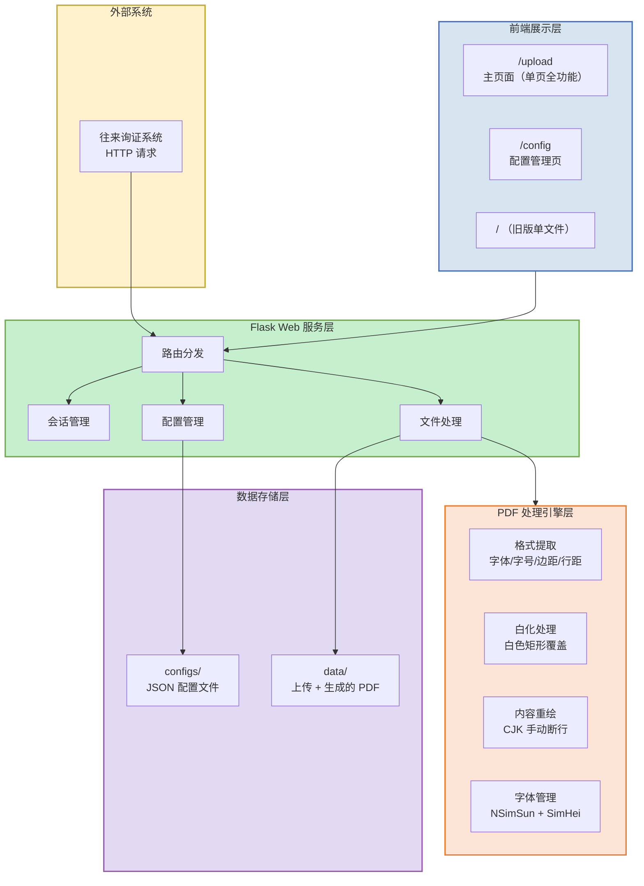
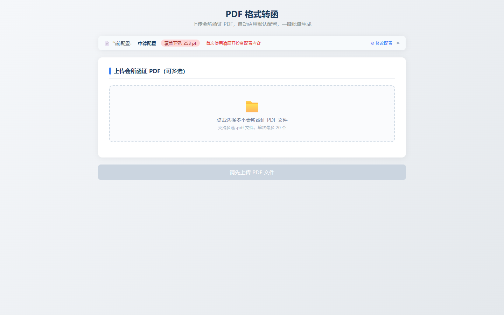
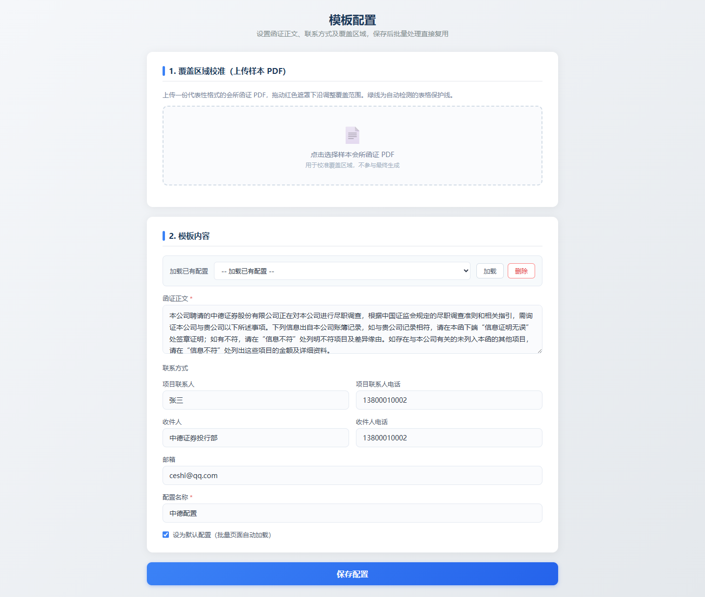
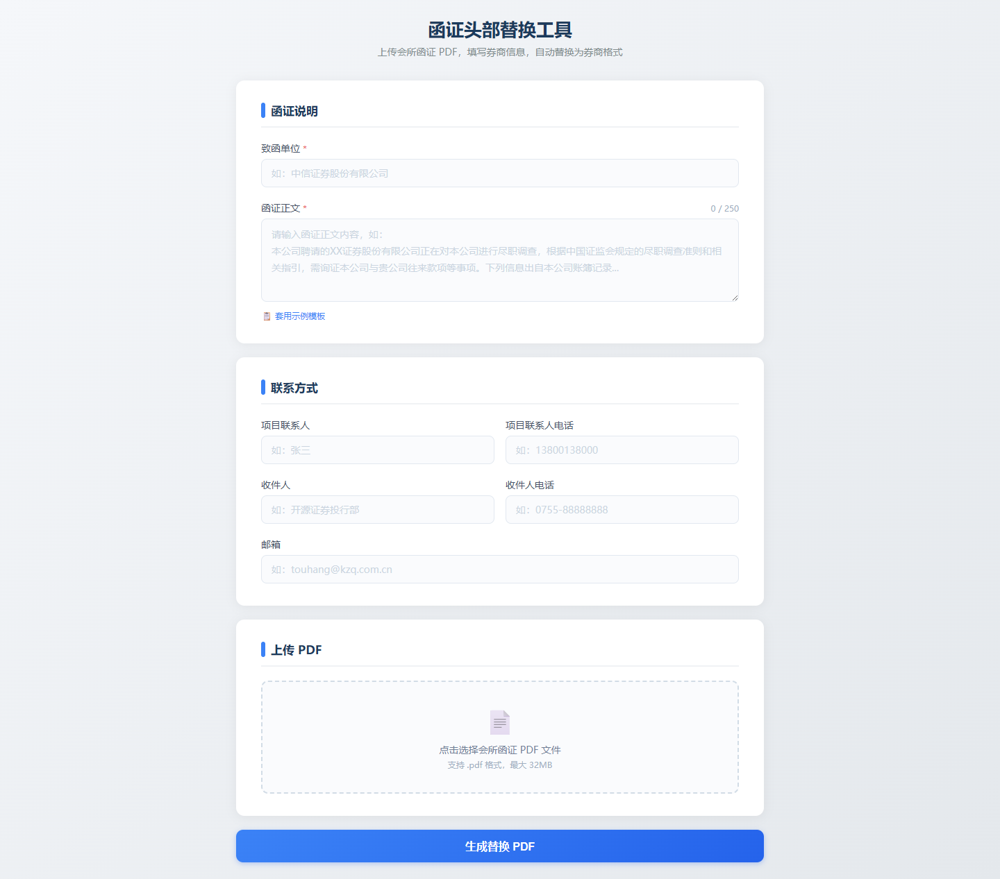
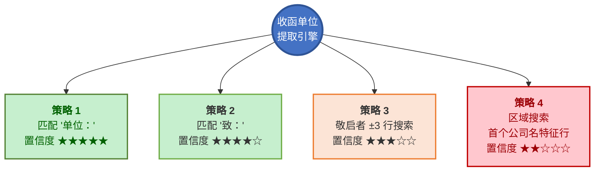
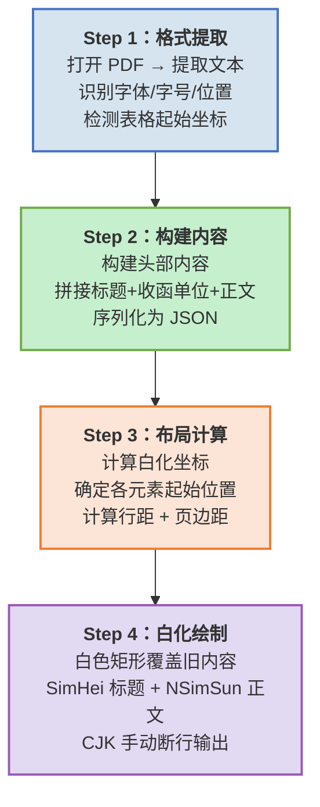
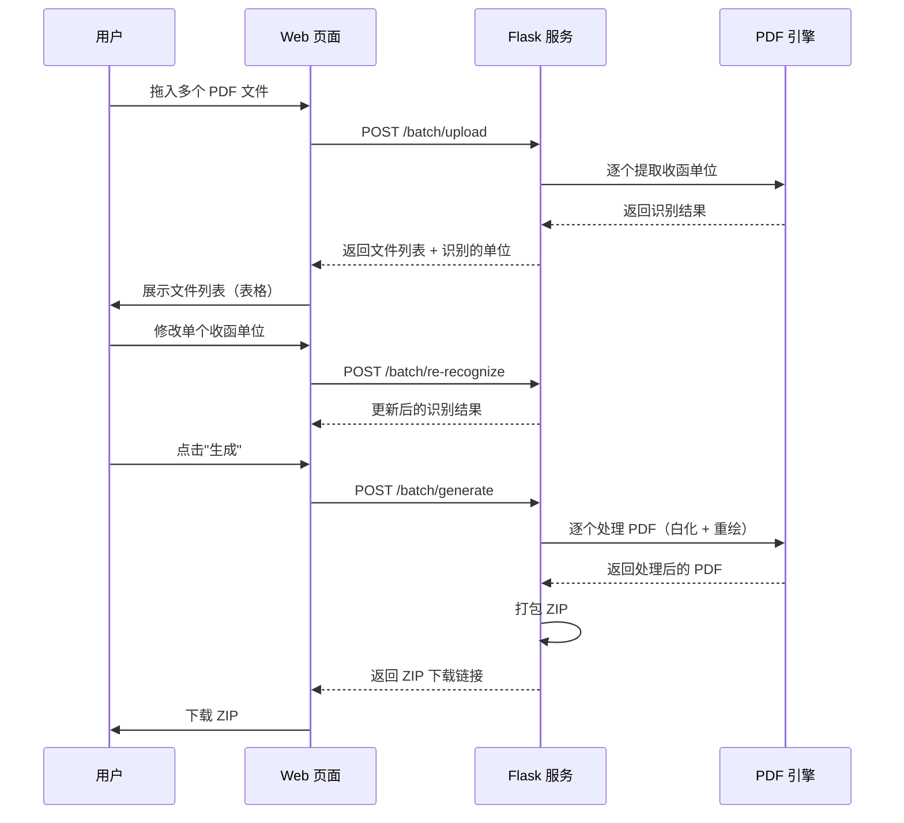
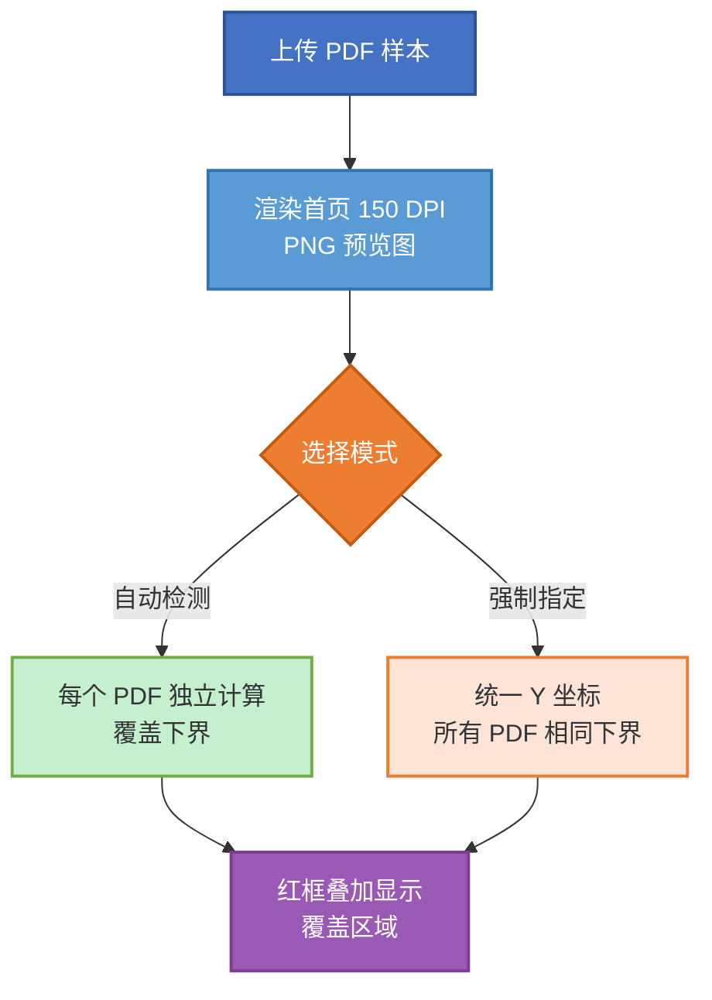
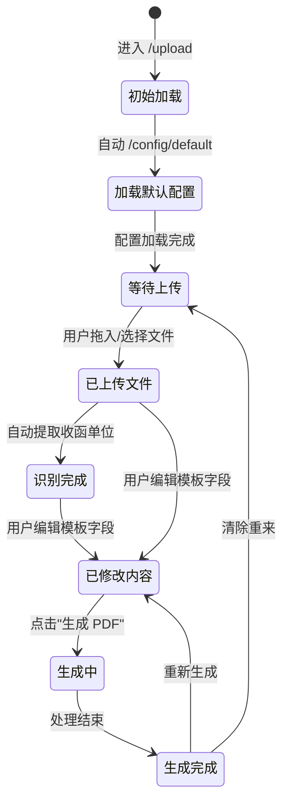

# 函证 PDF 头部内容替换工具 — 需求规格说明书

> **版本**：v4.0  
> **日期**：2026-07-17  
> **状态**：终稿  
> **主要变更**：改用 Mermaid 图表，Markdown 格式输出

---

## 目录

- [1. 项目背景与目标](#1-项目背景与目标)
- [2. 业务流程图](#2-业务流程图)
- [3. 系统架构](#3-系统架构)
- [4. 页面布局设计](#4-页面布局设计)
- [5. 配置管理体系](#5-配置管理体系)
- [6. 收函单位提取策略](#6-收函单位提取策略)
- [7. PDF 处理引擎](#7-pdf-处理引擎)
- [8. 批量处理 API](#8-批量处理-api)
- [9. 覆盖区域校准](#9-覆盖区域校准)
- [10. 前端状态管理](#10-前端状态管理)
- [11. 已知问题与经验教训](#11-已知问题与经验教训)
- [附录 A：Java 原版说明](#附录-ajava-原版说明)

---

## 1. 项目背景与目标

### 1.1 业务场景

券商（投行）项目组在 IPO、再融资等业务中需要向银行、客户发送大量询证函。实际操作中，项目组通常直接修改会计师事务所已完成的函证 PDF，**替换头部信息（函证说明、地址、联系人等）为券商项目组自身信息**，快速完成发函。

这是效率最高、错误最少的操作方式。

### 1.2 核心价值

| 维度 | 说明 |
|------|------|
| **提效** | 自动识别原 PDF 格式 → 白化 → 重写，1 分钟内完成手工需 10+ 分钟的操作 |
| **防错** | 智能提取收函单位、自动计算布局，避免手动输入错漏 |
| **批量** | 一次上传最多 20 份 PDF，自动批量识别 + 批量替换 + 打包下载 |
| **复用** | 配置模板持久化，一键加载券商默认信息 |

### 1.3 技术选型

| 层 | Java 版（主力） | Python 版（备选） |
|----|----------------|-------------------|
| **Web 框架** | JDK 内置 HttpServer | Flask |
| **PDF 处理** | Apache PDFBox 2.0.27 | PyMuPDF + pdfplumber |
| **前端** | HTML5 + CSS3 + Vanilla JS | 同 Java 版（共享模板） |
| **字体** | NSimSun.ttf + SimHei.ttf | 同 Java 版 |
| **端口** | 8889 | 8888 |

> Java 版为主力运行方案，Python 版用于快速功能验证。两版核心逻辑保持一致。

---

## 2. 业务流程图


**流程说明**：

1. **上传 PDF** — 用户上传会计师事务所出具的函证 PDF 文件
2. **智能识别** — 系统自动提取原 PDF 格式参数（字体、字号、边距、行距），并识别收函单位
3. **核对编辑** — 用户在 Web 界面确认/修改识别的结果，填入券商联系方式
4. **生成替换** — 白化原头部区域，按原格式重新绘制券商信息
5. **下载预览** — 下载最终 PDF，检查效果

---

## 3. 系统架构



**分层说明**：

| 层 | 说明 | 关键技术 |
|----|------|----------|
| 外部系统 | 往来询证系统通过 HTTP 调用本工具 | HTTP 请求 |
| 前端展示层 | 单页面应用，三大功能入口 | HTML5 + CSS3 + JS，无框架 |
| Web 服务层 | 路由分发、会话管理、配置管理、文件处理 | Flask / JDK HttpServer |
| PDF 处理引擎 | 格式提取 → 白化 → 重绘 → 字体管理 | PyMuPDF / Apache PDFBox |
| 数据存储层 | JSON 配置 + PDF 文件持久化 | 本地文件系统 |

### 3.1 API 路由表

#### 单文件处理

| 路由 | 方法 | 功能 |
|------|------|------|
| `/` | GET | 单文件处理页面（旧版） |
| `/preview` | POST | 上传 PDF，渲染首页 PNG 预览 |
| `/preview-img/<filename>` | GET | 预览图片静态服务 |
| `/generate` | POST | 接收表单数据，生成替换后 PDF |
| `/download/<filename>` | GET | 下载生成的 PDF |

#### 批量处理（`/upload` 主入口）

| 路由 | 方法 | 功能 |
|------|------|------|
| `/upload` | GET | **主页面**（单页全功能） |
| `/batch` | GET | 301 重定向到 `/upload` |
| `/batch/upload` | POST | 批量上传（最多 20 份），自动提取收函单位 |
| `/batch/preview/<token>/<filename>` | GET | 单个 PDF 的首页缩略图 |
| `/batch/re-recognize` | POST | 重新识别单个文件的收函单位 |
| `/batch/generate` | POST | 批量生成 PDF → 打包 ZIP 下载 |
| `/batch/download/<token>` | GET | 下载 ZIP 包 |

#### 配置管理

| 路由 | 方法 | 功能 |
|------|------|------|
| `/config` | GET | 配置管理页面 |
| `/config/default` | GET | 获取默认配置 |
| `/config/list` | GET | 列出所有可用配置 |
| `/config/load/<name>` | GET | 加载指定配置 |
| `/config/save` | POST | 保存新配置 |
| `/config/delete/<name>` | DELETE | 删除配置 |
| `/config/preview` | POST | 上传样本 PDF 预览 + 表格检测 |

---

## 4. 页面布局设计

### 4.1 主页面（`/upload`）— 单页全功能

以折叠面板（Accordion）组织三大功能模块，实现"上传→预览→填写→生成"一站式操作。

```
┌──────────────────────────────────────────────────────┐
│  函证 PDF 头部内容替换工具                            │
├──────────────────────────────────────────────────────┤
│                                                      │
│  ┌─ 步骤 1：上传 PDF ──────────────────────────────┐  │
│  │  拖拽区 / 文件选择按钮 / 已上传列表               │  │
│  │  每份 PDF 自动提取收函单位并显示                  │  │
│  └────────────────────────────────────────────────┘  │
│                                                      │
│  ┌─ 步骤 2：填写内容 ──────────────────────────────┐  │
│  │  模板名称下拉框（含默认）                          │  │
│  │  函证正文 textarea（最长 300 字符，含字数统计）     │  │
│  │  联系方式表格（5 字段）                            │  │
│  └────────────────────────────────────────────────┘  │
│                                                      │
│  ┌─ 步骤 3：覆盖区域校准 ──────────────────────────┐  │
│  │  PDF 首页预览图 + 红色遮罩 + 拖拽调整下界          │  │
│  │  自动检测 / 强制指定 切换开关                      │  │
│  └────────────────────────────────────────────────┘  │
│                                                      │
│  [ 生成 PDF ]  [ 下载 ZIP ]                          │
│                                                      │
└──────────────────────────────────────────────────────┘
```

#### 页面截图（实际开发效果）



> 页面标题：PDF 格式转函 | 三个步骤折叠面板（上传 PDF → 填写内容 → 覆盖区域校准），底部操作按钮

### 4.2 配置管理页面（`/config`）

两部分设计：

- **步骤 1：覆盖区域校准** — 上传一份样本 PDF，拖拽调整覆盖下界，预览白化效果
- **步骤 2：模板内容编辑** — 填写函证正文 + 联系方式，保存/更新/删除模板，设置默认



> 页面标题：模板配置 - 函证头部替换工具 | 步骤1：上传样本 PDF 校准覆盖区域 | 步骤2：编辑模板内容

### 4.3 旧版单文件页面（`/`）

旧版兼容入口，提供单文件处理的基础功能（包含 PDF 预览拖拽交互）。



---

## 5. 配置管理体系

### 5.1 配置流程


### 5.2 配置存储结构

```
python/configs/
├── _default.txt          ← 仅存一行：默认配置名
├── 中德配置.json          ← 当前默认配置
└── ceshi配置.json         ← 测试用
```

**配置 JSON 结构**：

```json
{
  "name": "中德配置",
  "body_text": "本公司聘请的中德证券股份有限公司...",
  "contacts": {
    "项目联系人": "张三",
    "项目联系人电话": "13800010002",
    "收件人": "中德证券投行部",
    "收件人电话": "13800010002",
    "邮箱": "ceshi@qq.com"
  },
  "whiteout_bottom": 253
}
```

| 字段 | 说明 |
|------|------|
| `name` | 配置展示名称 |
| `body_text` | 函证正文，最长 300 字符 |
| `contacts` | 联系方式（5 个固定字段） |
| `whiteout_bottom` | 覆盖下界 Y 坐标，`null` = 自动检测 |

### 5.3 设计原则

- **配置和上传分离**：高频操作（上传+生成）在 `/upload`；低频操作（保存/调整模板）在 `/config`
- **每次进入 `/upload` 自动加载默认模板**，用户可临时修改（不持久化）
- **覆盖下界**：默认用配置值；仅当用户勾选"手动值"时才覆盖

---

## 6. 收函单位提取策略



**提取区域**：PDF 首页 y ∈ [50, 300] 像素范围，逐行扫描

| 优先级 | 策略 | 触发条件 | 置信度 |
|--------|------|----------|--------|
| **P1** | 匹配"单位：" | 行内包含"单位：" | ★★★★★ |
| **P2** | 匹配"致：" | 行内包含"致：" | ★★★★☆ |
| **P3a** | 敬启者同行 | 同行提取文本 | ★★★☆☆ |
| **P3b** | 敬启者邻行 | 向前后 ±3 行搜索 | ★★★☆☆ |
| **P4** | 区域搜索 | 首个符合公司名特征的行 | ★★☆☆☆ |
| — | 兜底 | 全部失败返回空 | ☆☆☆☆☆ |

**公司名特征判断**：
- 长度 4~30 个字符
- 中文占比 ≥ 50%
- 排除关键词：编号、索引、询证函、会计师、审计、列示、余额、项目联系人、回函地址等

---

## 7. PDF 处理引擎

### 7.1 处理流程



### 7.2 Step 1：格式提取

从原 PDF 首页自动提取：

- **正文字号**：y ∈ [50, 270] 区域内字符的最常见字号
- **标题字号**：y < 50 区域内的字号（通常比正文大）
- **左边距**：文本行的最小 x 坐标
- **段落宽度**：最大 x - 最小 x
- **行间距**：相邻行 y 坐标差值的均值
- **表格起始 Y**：通过关键词"往来余额""列示如下""金额"定位

### 7.3 Step 3：布局计算

```
页面顶部
  ├── 标题行（居中，SimHei 加粗）
  ├── 收函单位行（左对齐，按原格式）
  ├── 函证正文（CJK 手动断行，左对齐）
  ├── 加粗提示行（SimHei，固定文字）
  ├── 联系方式（两栏自适应布局）
  │   ├── 项目联系人（左）| 项目联系人电话（右）
  │   ├── 收件人（左）| 收件人电话（右）
  │   └── 邮箱（全宽单行）
  └──→ 白色覆盖下界
页面底部
  └── 原 PDF 表格区域（完全保护，不修改）
```

### 7.4 联系方式两栏布局规则

- 栏间距：20 pt
- 行间距：字号 × 1.25
- 左栏左对齐于正文左边距
- 右栏右对齐于正文右边距（左边距 + 段落宽度）
- "邮箱"行独占全宽，双行文字输出

### 7.5 CJK 手动断行算法

逐字符累加宽度预估，避免自动换行导致的标点错位：

```
全角字符宽度 = fontsize × 1     // 中文、中文标点
半角字符宽度 = fontsize × 0.55  // 英文、数字、英文标点
```

---

## 8. 批量处理 API

### 8.1 批量处理流程



### 8.2 批量处理能力

| 项目 | 限制 |
|------|------|
| 单次上传文件数 | 最多 20 个 |
| 支持格式 | PDF（.pdf） |
| 输出格式 | ZIP 压缩包 |
| 会话有效期 | 30 分钟 |

---

## 9. 覆盖区域校准

### 9.1 两种模式



### 9.2 可视化交互

- 红色半透明遮罩覆盖将要被白化的区域
- 绿色横线标注表格保护起始位置
- 鼠标拖拽（或触摸滑动）调整覆盖下界
- 实时更新 Y 坐标数值显示

---

## 10. 前端状态管理

### 10.1 页面状态机



### 10.2 关键状态变量

| 变量 | 类型 | 说明 |
|------|------|------|
| `uploadedFiles` | Array | 已上传文件列表（含 token） |
| `currentConfig` | Object | 当前加载的配置模板 |
| `whiteoutMode` | String | `"auto"` 或 `"manual"` |
| `whiteoutBottom` | Number|null | 手动模式下的覆盖下界值 |
| `generatedToken` | String | 生成完成后的下载 token |

---

## 11. 已知问题与经验教训

| 问题 | 原因 | 解决方案 |
|------|------|----------|
| **坐标系混用** | PDFBox 左下角原点 vs 前端左上角原点 | 统一坐标系后再做 min/max 计算 |
| **simsunb.ttf 陷阱** | 该文件实为 SimSun-ExtB，缺少常用汉字 | 改用 SimHei.ttf 真黑体 |
| **伪加粗重影** | 中文宋体任何偏移都产生重影 | 使用真粗体字体（SimHei） |
| **Windows 中文乱码** | 命令行编码 + JVM 编码不一致 | chcp 65001 + `-Dfile.encoding` + 重包装 System.out |
| **批量下载后缀丢失** | 文件名清洗时 .pdf 的点号被转成 _ | 先分离扩展名再清洗文件名 |
| **白化参数失效** | `whiteout_bottom` 写在 catch 块中 | 移到正常流程中传递 |

### 设计约束

| 项目 | 约束 |
|------|------|
| 函证正文最大长度 | 300 字符 |
| 联系方式固定字段 | 5 个（项目联系人、电话、收件人、电话、邮箱） |
| 提示行文字 | 固定模板，不可修改 |
| 表格区域 | 原封不动保留，不做任何改动 |
| 正文字体 | NSimSun（新宋体） |
| 标题字体 | SimHei（黑体加粗） |

---

## 附录 A：Java 原版说明

Java 版为主力运行方案，核心类：

| 类名 | 功能 |
|------|------|
| `WebServer.java` | HTTP 服务主程序，端口 8889 |
| `HanzhengPdfTool.java` | CLI 命令行入口 |
| `PdfProcessor.java` | PDF 处理核心（格式提取 + 白化 + 重绘） |
| `FormatExtractor.java` | 格式自动提取 |
| `CjkWrapper.java` | CJK 手动断行 |

### 启动方式

```batch
cd java
run.bat          # 启动 Web 服务
start_server.bat # 后台启动
```

### 依赖

```xml
<dependency>
    <groupId>org.apache.pdfbox</groupId>
    <artifactId>pdfbox</artifactId>
    <version>2.0.27</version>
</dependency>
```

---

> **文档结束**  
> 版本：v4.0 | 日期：2026-07-17 | 图表引擎：Mermaid
